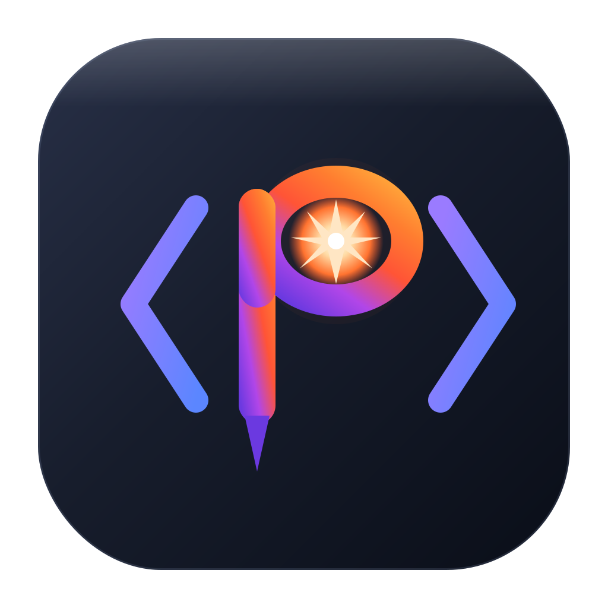

<div align="center">



# Photon IDE

**A lightweight, native PHP / Laravel IDE — PhpStorm-depth intelligence at Fleet/VS Code speed.**

[](https://github.com/BackendDevops/photon-ide/actions/workflows/ci.yml)
[](./LICENSE)
[](#)
[](https://tauri.app)
[](https://rustup.rs)

</div>

---

Photon is a real desktop IDE for PHP and Laravel: a **Rust core** does the heavy
lifting (parsing, indexing, analysis) off the UI thread, while a clean,
borderless **React + Monaco** front-end stays fast and distraction-free. No
bundled Chromium — it runs on the OS WebView via **Tauri 2**, so the app is small
and light, masking the engineering powerhouse underneath.

The full design lives in [`docs/`](./docs/00-architecture-index.md).

## Highlights

**Code intelligence (tree-sitter + a real type engine)**
- Symbol index across namespaces, classes, interfaces, traits, enums, functions, methods, properties and constants — with fully-qualified names and precise locations.
- **Symbol-resolved navigation**: Cmd/Ctrl+click a declaration → Find Usages; a use-site → Go to Definition. Member accesses are **receiver-aware** (`$this->svc->find()` resolves the chain to the right class).
- **Chain-resolving completion** through method return types and property types, including `self`/`static` and the Eloquent query builder.
- **Go to Definition / Type Definition / Implementations**, rich PhpStorm-style hover, and **vendor/framework indexing** (declaration-level, deferred, off the UI thread) so `Illuminate\…` is searchable and jump-to-able.
- **Inspection engine**: unused/duplicate imports, leftover debug statements, undefined `$this->member`, unreachable code, missing return types, enum `match` exhaustiveness — with one-click quick-fixes.

**Refactoring (plan → preview → apply)**
- **Inline Safe Rename** across the project with per-edit preview and uncertain-reference flagging.
- **Extract Variable / Extract Method / Inline Variable / Safe Delete**, **Change Signature**, **Move Class** (PSR-4 aware).
- **Alt+Enter context actions**: add `#[\Override]`, **convert to PHP 8 constructor property promotion**, add inferred return type, import class.

**Laravel depth**
- Eloquent model + relationship inference, real columns parsed from migrations, local scopes, dynamic `whereColumn`.
- `route()` / `config()` / `env()` / `__()` key completion **and** Cmd+click navigation; validation-rule completion; container-binding navigation.
- 20+ code generators (New from Template) and **Generate Model PHPDoc**; **Run Artisan** runner; Blade `<x-component>` & directive completion.

**Git (flagship, GitKraken-inspired — [`docs/16`](./docs/16-git-experience.md))**
- Virtualized **commit graph** (100k+ rows), commit workspace, per-hunk staging, amend/reset/revert.
- Drag-and-drop graph ops, **interactive rebase** timeline, **conflict resolution** center, repository **insights**, lightweight **PR** links, AI-style commit messages.
- Editor **gutter diff bars** + overview markers, status-bar **branch hub** popover, branch-aware tab memory.

**Debugging — Xdebug (DBGp)**
- Breakpoints (incl. **conditional**), step in/over/out, call stack, variable inspection with nested expansion, **inline values**, and a floating debug toolbar.

**Database & data**
- Connection manager + schema explorer + **query console** for MySQL / MariaDB / PostgreSQL / SQLite (sqlx `Any`), inline-cell edit, and a **Redis** console.

**Productivity & UX**
- **Tabbed bottom dock** (Terminal · Xdebug · **HTTP API client**), **right tool strip** (Architecture Map · Structure), **Live Architecture Map** (dependency graph from the active file).
- **Keyboard-first "Zero-Mouse Flow"**: `F6` cycles focus across panels with a subtle focus ring.
- **Native Vim mode** (normal/insert/visual + `:` command line) running directly on the editor, with a `-- NORMAL --` mode bar.
- Search Everywhere (`Shift Shift`), Recent Files/Locations (`⌘E`), integrated multi-terminal, devcontainer detection pill, vendor isolation in the file tree, breadcrumb dropdown, local history, resizable panels, UI scale.

**AI, Marketplace & Community**
- **AI Workspace** (✦): project-aware chat, BYO-key, OpenAI-compatible — works with OpenAI / OpenRouter / Azure and **local Ollama** (privacy-first offline toggle).
- **Marketplace** panel framing extensions as WASM-sandboxed add-ons with per-extension **CPU / RAM telemetry**.
- **Community Hub** (✦, lower-left): report bugs / request features / open GitHub Discussions without leaving the editor.

## Keyboard shortcuts (selected)

| Action | Shortcut |
| --- | --- |
| Search Everywhere | `Shift Shift` / `⌘P` |
| Save (+ re-index) | `⌘S` |
| Recent files / locations | `⌘E` |
| Go to Definition | `F12` / `⌘B` |
| Go to Implementation | `⌘⌥B` |
| Find Usages | `Shift+F12` |
| Rename | `F2` |
| Extract Variable / Method | `⌘⌥V` / `⌘⌥M` |
| Context actions (Alt+Enter) | `⌥↵` |
| Toggle terminal / dock | `` ⌘` `` |
| Cycle panel focus | `F6` (Shift+F6 reverse) |
| New from Template | `⌘N` |
| Toggle breakpoint | `F9` |

## Tech stack

- **Shell:** Tauri 2 (Rust backend + OS WebView)
- **Core:** Rust workspace — `crates/photon-core` (pure, unit-tested) + `src-tauri` (Tauri commands)
- **Parsing/analysis:** tree-sitter (`tree-sitter-php`), rusqlite (bundled SQLite, WAL), notify (fs watcher)
- **Data/IO:** sqlx (`Any`/MySQL/Postgres/SQLite), redis, reqwest, portable-pty
- **Front-end:** React 18 + TypeScript + Tailwind 3 + Vite 5 + Monaco

## Getting started

### Prerequisites
- **Rust** (stable) — https://rustup.rs
- **Node.js 18+** and npm
- Tauri 2 platform deps — https://tauri.app/start/prerequisites/
  - macOS: `xcode-select --install`
  - Linux: `webkit2gtk`, `libgtk-3-dev`, … (see link)
  - Windows: WebView2 (preinstalled on Win 11) + MSVC build tools

### Develop
```bash
npm install
npm run tauri:dev      # builds the Rust core + serves the UI in a native window
```
The first Rust build compiles tree-sitter + bundled SQLite, so it takes a few minutes; later runs are fast.

### Build a distributable
```bash
npm run tauri:build    # native bundle for your OS (.dmg / .msi / .deb / .AppImage)
```

### Verify the core (no GUI needed)
```bash
cargo test -p photon-core   # PHP symbol/reference extraction, Safe Rename, routes, Eloquent, fuzzy ranker, …
npm run typecheck           # tsc --noEmit
npm run build               # tsc + vite build
```

## Project structure

```
photon-ide/
├─ crates/photon-core/      # pure Rust logic — no GUI dependency, unit-tested
│  └─ src/                  # workspace, db (SQLite), php (tree-sitter), laravel,
│                           # phpdoc, search, indexer, lib (public API + tests)
├─ src-tauri/               # Tauri shell: state + invoke commands
│  ├─ src/lib.rs            # ~125 commands (open_project, search, git_*, db_*, debug_*, http_request, …)
│  ├─ src/git.rs · debugger.rs · redis.rs · …
│  └─ icons/                # app icon set (png / icns / ico / svg)
├─ src/                     # React UI
│  ├─ App.tsx               # layout, state, focus flow, keybindings
│  ├─ lib/                  # api.ts (typed Tauri bindings), settings, vim.ts, promote.ts
│  └─ components/           # EditorPane, FileTree, Git*, DebugPanel, HttpClient,
│                           # ArchMap, CommunityHub, ExtensionsPanel (marketplace), …
└─ docs/                    # full architecture + roadmaps (00–19)
```

The boundary is deliberate: **all real logic lives in `photon-core`** (GUI-free, testable); the Tauri layer is glue. The engine can grow without touching the shell.

## Roadmap

Shipped through **2.13.0** — see the feature list above. The next horizon is platform-level R&D (tracked in [`docs/`](./docs/00-architecture-index.md)):

- WASM extension **runtime** + marketplace backend (the UI + telemetry framing ship today)
- Vim engine lowered onto the **Rust core** for zero-latency macros
- Live **pair-programming** (WebRTC/CRDT), **time-travel** step-back debugging, and Docker devcontainer **Xdebug tunneling**
- Real inline **micro-profiling** counters

## Contributing

Issues and PRs are welcome. For substantial changes, please open an issue first to
discuss direction. Run `cargo test -p photon-core` and `npm run build` before
submitting. The in-app **Community Hub** (✦) can pre-fill a bug/feature issue.

## License

[MIT](./LICENSE) © Photon IDE contributors
